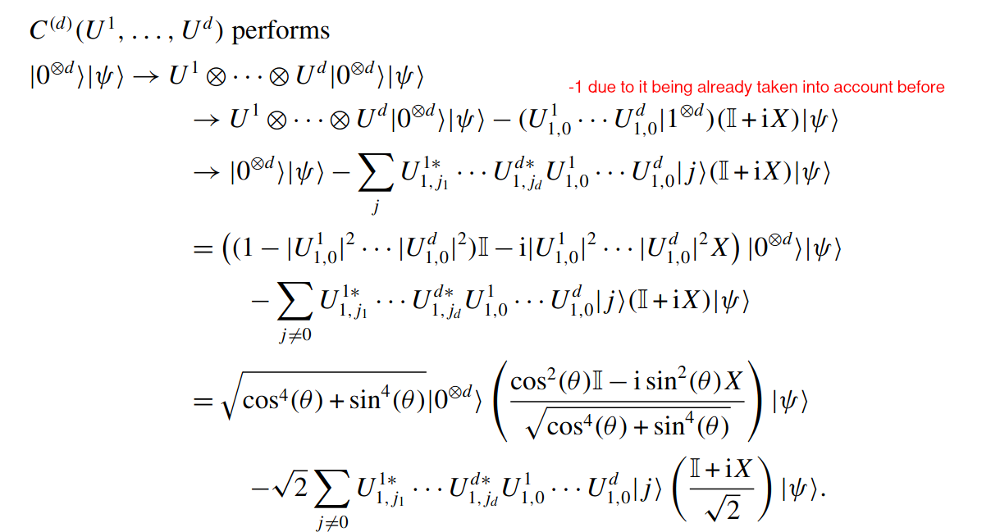

# Personal Notes

## Quantum Neuron

### Concepts

#### Gearbox circuit

Given the product of U(1,0) is sin^2(theta) then it can be proved the probability of g(theta) is ...
Why? Larger gears are turned to turn small gears
So lets say we need a composition of smaller rotations then we can simply use the g(theta) as the new theta. 
Need of S Gate if R_x is applied as need sin^2.

Original use: floating point representation

#### QRAM

Used for encoding of classical into quantum inputs.

#### Feed forward networks

Uses ZZ observable to calculate accuracy.
Uses Nelder-mead algorithm which is a gradient free local optimiztion technique
Training done using superposition of state.

#### Hopfield network

Fully connected network where neurons are randomly updated based on weighted sum.
Has **Associative Memory**.

**Note**: The quantum NN can be trained on a superposition of inputs.

1. The initial state of the quantum system encodes any binary string of length N ;
2. The QNN reflects one or more basic neural computing mechanisms;
3. The evolution is based on quantum effects, such as superposition, entanglement and interference, and it is fully consistent with quantum theory.

### Uses

- Autoencoders: copy input to output through non-linearity leading to data compression
- Activation functions: ReLU using (phi > 0 --> |1>  --> CR(phi))

### Doubts
- [ ] How to convert the output state to classical output? Or is it just for training? 
- [ ] How does expected output in superposition work?

## Nelder Mead Algorithm

## Arbitrary Quantum Activation Functions

Does n-2^n encoding which means exponential no. of input neurons can be encoded into amplitudes of superposition to implement reversible activation functions.

## Phase Estimation

### Spectral Decomposition

Given a unitary matrix U, it can be decomposed into a sum of eigenvalues and eigenvectors. The eigenvalues are the phases of the eigenvectors. THe eigen values are unique upto a global phase, and lie on the unit circle( i.e $e^{2\pi i \theta}$).

### Quantum Fourier Transform

$$
\begin{aligned}
    QFT_N = \frac{1}{\sqrt{N}} \sum_{x=0}^{N-1} \sum_{y=0}^{N-1} e^{2\pi i \frac{xy}{N}} \ket{y}\bra{x}
\end{aligned}
$$

> [!IMPORTANT]
> It doesn;t matter which is the control qubit in controlled phase shift gate. The phase is applied to the entangled qubit.

## Ideas

1. Use of quantum annealing to discover the optimised state instead of gate-based circuits.
2. Implementation of CNN in Quantum
